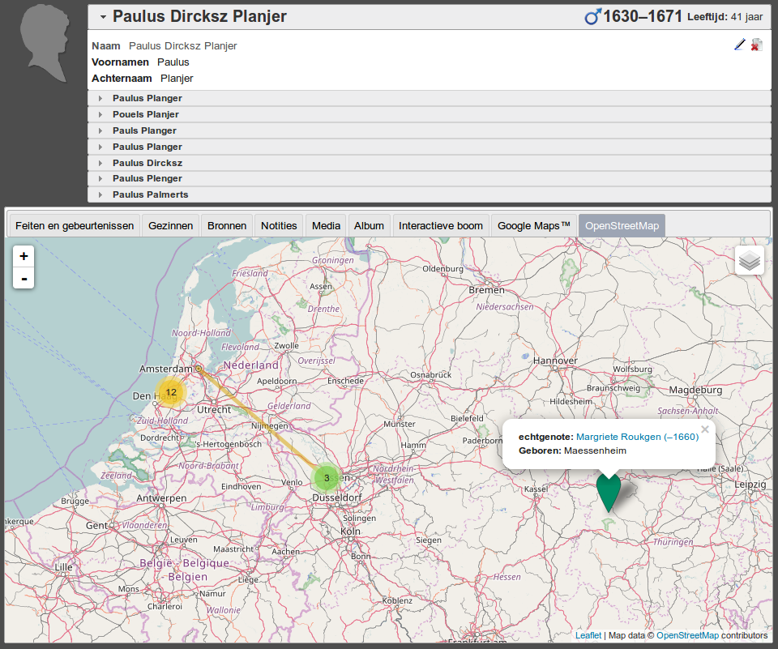

# OSM4WebTrees
Module for [WebTrees](http://webtrees.net) to show genealogical location data on on [OpenStreetMap](openstreetsmap.org) (OSM) tiles, and displayed via [Leaflet](leafletjs.com).

## Requirements
This module requires webtrees 1.7.9+.

For now, this module relies a bit on the Google Maps module. In the future, the plan is to remove that requirement.

## Installation
### via zip/tarball
Download the plugin, based on your webtrees version, and unpack it into `webtrees/modules/openstreetmap`

| WebTrees version | zip | tarball |
|------------------|-----|---------|
| >= 1.7.x         | [zip](https://github.com/Joppla/OSM4WebTrees/archive/OSM4WebTrees1.7.9-v.01.zip) | [tar.gz](https://github.com/Joppla/OSM4WebTrees/archive/OSM4WebTrees1.7.9-v.01.tar.gz) |

## Contributing

Feel free to open a PR with any changes you'd like to make to this plugin. I don't have a whole lot of time to devote to this, but I will definitely review (and probably merge) any PRs in a timely manner.
